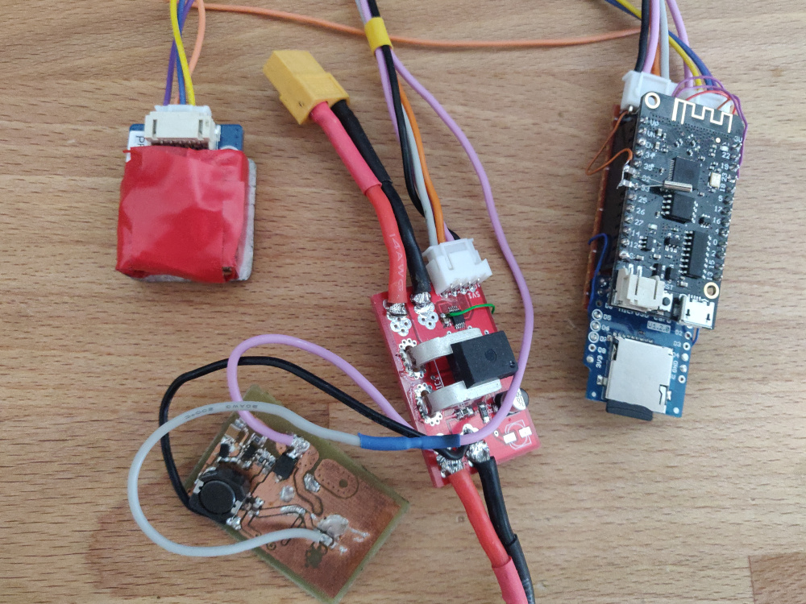
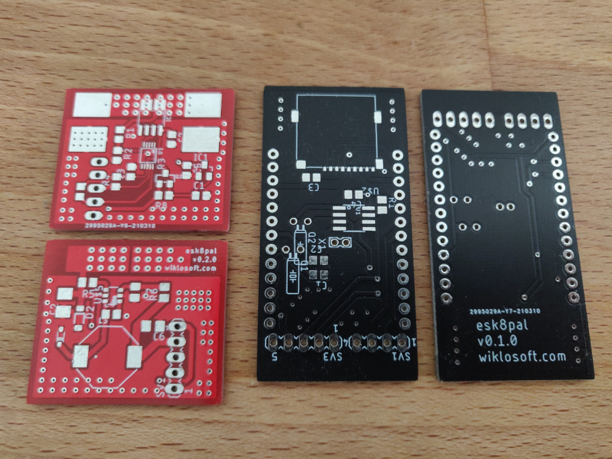

# esk8pal power module

This repository contains eagle project for power board that is used in esp8pal project. It contains DC-DC converter, current and voltage sensor connected do ADC chip. Board used i2c interface to connect with main board. 

 For other repositories from esk8pal project go to:

- Frontend Angular Appplication - https://github.com/pwiklowski/esk8pal-web-be
- Backend service - https://github.com/pwiklowski/esk8pal-web-be
- ESP32 Firmware - https://github.com/pwiklowski/esk8pal-device
- PWA companion application that uses Web Bluetooth API (WIP)- https://github.com/pwiklowski/esk8pal-pwa
- Android application - https://github.com/pwiklowski/esk8pal-android

## Schematic

## PCB

## Prototype

## New PCB's - power module 0.2.0 and main board 0.1.

