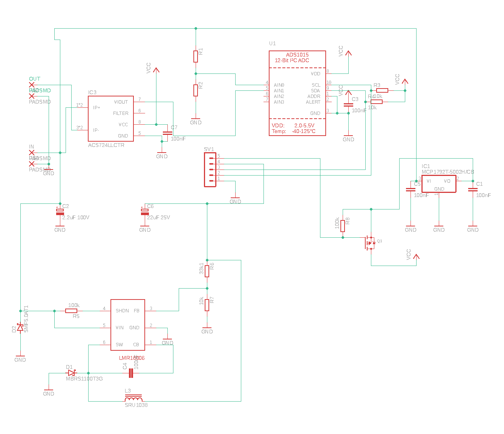
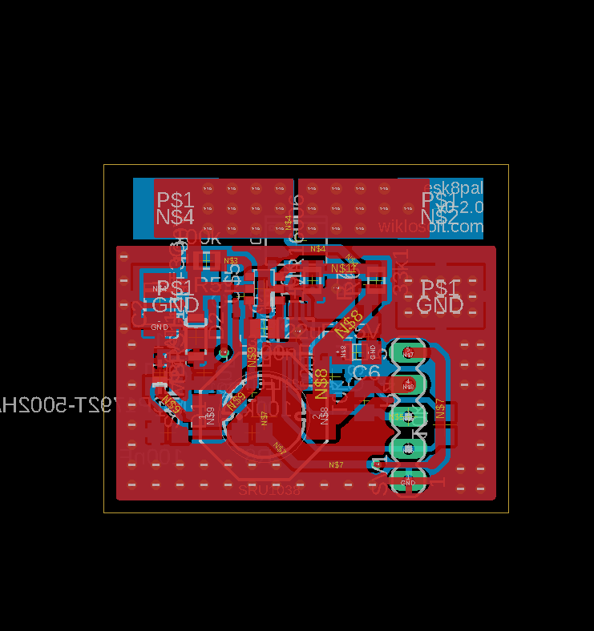

# esk8pal power module

This repository contains eagle project for power board that is used in esp8pal project. It contains DC-DC converter, current and voltage sensor connected do ADC chip. Board used i2c interface to connect with main board. 

## Schematic

## PCB

